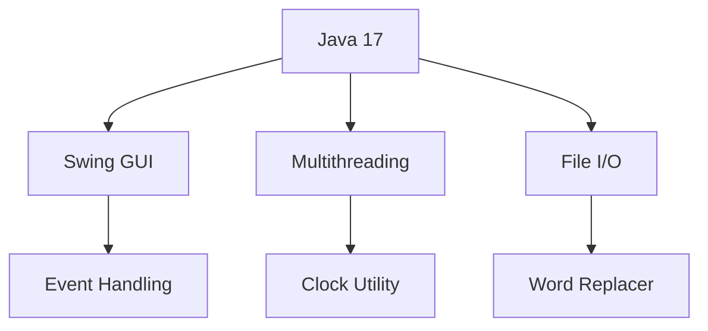

<div align="center">
  <h1>🎓 Student Utility Manager</h1>
  <p>A comprehensive Java Swing application with multiple academic utilities</p>
  
  <div>
    
    
    
  </div>
</div>

<br>


---

## 🌟 Features

---

<table>
  <tr>
    <td width="33%">
      <h3>🧮 Calculator</h3>
      <ul>
        <li>Basic arithmetic operations</li>
        <li>Clear functionality</li>
        <li>Intuitive interface</li>
      </ul>
    </td>
    <td width="33%">
      <h3>📊 GPA Calculator</h3>
      <ul>
        <li>5-subject capacity</li>
        <li>1-10 scale validation</li>
        <li>Auto-average calculation</li>
      </ul>
    </td>
    <td width="33%">
      <h3>🎨 Drawing Pad</h3>
      <ul>
        <li>Freehand drawing</li>
        <li>4 color options</li>
        <li>Canvas clearing</li>
      </ul>
    </td>
  </tr>
  <tr>
    <td>
      <h3>📝 To-Do List</h3>
      <ul>
        <li>Add/remove tasks</li>
        <li>Persistent list</li>
        <li>Simple interface</li>
      </ul>
    </td>
    <td>
      <h3>🔄 Unit Converter</h3>
      <ul>
        <li>18 conversion types</li>
        <li>STEM-focused units</li>
        <li>Real-time results</li>
      </ul>
    </td>
    <td>
      <h3>✏️ Word Replacer</h3>
      <ul>
        <li>Find/replace in files</li>
        <li>File I/O operations</li>
        <li>Text editing</li>
      </ul>
    </td>
  </tr>
</table>
---
## 🛠️ Tech Stack
---



## 🚀 Quick Start

```bash
# Clone the repository
git clone https://github.com/ArnavM21git/StudentUtilityManager.git

# Compile and run
cd StudentUtilityManager
javac studenttools/StudentAssistantApp.java
java studenttools.StudentAssistantApp
```


## 📂 Project Structure

```
src/
├── studenttools/
│   ├── MainFrames/
│   ├── Utilities/
│   └── Clock/
├── CalculatorFrame.java
├── GPAFrame.java
└── ...
```
